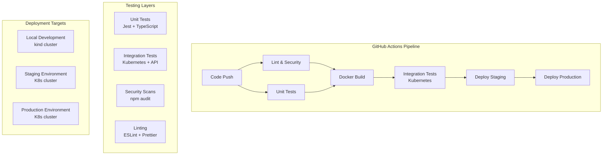

# VizCore CI/CD Pipeline Documentation

## Overview

VizCore uses a comprehensive CI/CD pipeline that includes unit tests, integration tests, Docker builds, and Kubernetes deployments. The pipeline is built with GitHub Actions and provides automated testing and deployment to multiple environments.

## Pipeline Architecture



## Pipeline Stages

### 1. Lint and Security (`lint-and-security` job)

**Purpose**: Code quality and security checks
**Runs on**: All pushes and PRs
**Duration**: ~2-3 minutes

**Steps**:
- ESLint code quality checks (if configured)
- Prettier formatting checks (if configured)  
- npm audit for security vulnerabilities
- Fails build if critical security issues found

### 2. Unit Tests (`test` job)

**Purpose**: Core functionality testing
**Runs on**: All pushes and PRs
**Matrix**: Node.js 18.x and 20.x
**Duration**: ~3-5 minutes

**Steps**:
- Install dependencies with `npm ci`
- Run Jest test suite with coverage
- Upload coverage to Codecov
- Build TypeScript project
- Verify build artifacts exist

**Test Coverage**:
- Core VizCore functionality
- Memory management
- Performance monitoring
- Plugin registry
- Configuration handling

### 3. Docker Build (`docker` job)

**Purpose**: Container image creation
**Runs on**: Main branch only
**Duration**: ~5-8 minutes

**Steps**:
- Multi-stage Docker build
- Push to GitHub Container Registry (ghcr.io)
- Tag with branch name, SHA, and 'latest'
- Cache layers for faster builds

**Image Details**:
- Base: `node:18-alpine`
- Security: Non-root user (UID 1001)
- Size: Optimized with multi-stage build
- Health checks: Built-in container health monitoring

### 4. Integration Tests (`integration-test` job)

**Purpose**: End-to-end Kubernetes testing
**Runs on**: Main branch only (after Docker build)
**Duration**: ~8-12 minutes

**Test Environment**:
- **Cluster**: kind (Kubernetes in Docker)
- **Image**: Freshly built from Docker job
- **Namespace**: `vizcore`
- **Replicas**: 3 pods for HA testing

**Test Categories**:

#### Health Check Tests
- `/health` endpoint availability
- `/ready` endpoint functionality
- Response time validation
- Service startup verification

#### API Functionality Tests
- Root endpoint accessibility
- CORS headers validation
- Error handling (404, 405, 400)
- Security headers verification

#### Kubernetes-Specific Tests
- Resource limits enforcement
- Multi-replica deployment
- Service configuration
- Pod readiness and liveness

#### Performance Tests
- Response time benchmarks
- Concurrent request handling
- Load balancing verification
- Resource usage monitoring

**Failure Handling**:
- Automatic log collection
- Pod status reporting
- Event timeline capture
- Detailed error reporting

### 5. Staging Deployment (`deploy-staging` job)

**Purpose**: Automated staging deployment
**Runs on**: Main branch pushes (after integration tests pass)
**Environment**: `staging`

**Process**:
- Connect to staging Kubernetes cluster
- Update deployment with new image
- Apply Kubernetes manifests
- Wait for rollout completion
- Run smoke tests

### 6. Production Deployment (`deploy-production` job)

**Purpose**: Production deployment with approval
**Runs on**: Main branch pushes (after staging deployment)
**Environment**: `production`
**Requires**: Manual approval

**Process**:
- Manual approval gate
- Connect to production Kubernetes cluster
- Blue-green or rolling deployment
- Health check verification
- Rollback capability

## Test Configuration

### Unit Tests

**Location**: `packages/core/src/__tests__/`
**Framework**: Jest with TypeScript
**Coverage**: Minimum 80% line coverage
**Configuration**: `packages/core/jest.config.js`

```javascript
// Example test structure
describe('VizCore', () => {
  test('should initialize correctly', () => {
    const vizcore = new VizCore();
    expect(vizcore).toBeDefined();
  });
});
```

### Integration Tests

**Location**: `tests/integration/`
**Framework**: Jest with Axios
**Target**: Live Kubernetes deployment
**Configuration**: `tests/integration/package.json`

**Test Categories**:
- Health and readiness endpoints
- API functionality
- Performance benchmarks
- Security validation
- Kubernetes resource verification

## Local Development Testing

### Run Unit Tests
```bash
npm test
```

### Run Integration Tests Locally
```bash
# Using npm script
npm run test:integration

# Using direct script
bash scripts/test-k8s-integration.sh
```

### Manual Kubernetes Testing
```bash
# Build and deploy locally
docker build -t vizcore:latest .
kubectl apply -k k8s/

# Port forward for testing
kubectl port-forward service/vizcore-service 3000:80 -n vizcore

# Test endpoints
curl http://localhost:3000/health
curl http://localhost:3000/ready
```

## Environment Configuration

### GitHub Secrets Required

**For Docker Registry**:
- `GITHUB_TOKEN` (automatic)

**For Staging Deployment**:
- `KUBE_CONFIG_STAGING`: Base64 encoded kubeconfig
- `STAGING_CLUSTER_URL`: Staging cluster endpoint

**For Production Deployment**:
- `KUBE_CONFIG_PROD`: Base64 encoded kubeconfig  
- `PROD_CLUSTER_URL`: Production cluster endpoint

### Environment Variables

**CI Environment**:
```yaml
NODE_ENV: test
CI: true
```

**Application Environment**:
```yaml
NODE_ENV: production
LOG_LEVEL: info
MEMORY_THRESHOLD: 80
PERFORMANCE_MONITORING: true
```

## Monitoring and Observability

### Build Monitoring
- GitHub Actions status badges
- Slack/Teams notifications (configurable)
- Email alerts for failures

### Application Monitoring
- Health check endpoints
- Kubernetes liveness/readiness probes
- Resource usage metrics
- Error rate monitoring

### Test Reporting
- Coverage reports via Codecov
- Test result summaries
- Performance benchmarks
- Security scan results

## Troubleshooting

### Common Issues

#### Build Failures
```bash
# Check build logs
gh run view <run-id>

# Local debugging
docker build -t vizcore:latest .
```

#### Test Failures
```bash
# Run tests locally
npm test

# Integration test debugging
npm run test:integration
```

#### Deployment Issues
```bash
# Check Kubernetes status
kubectl get all -n vizcore
kubectl logs -l app=vizcore -n vizcore
```

### Debugging Integration Tests

1. **Port Forward Issues**:
   ```bash
   kubectl port-forward service/vizcore-service 3000:80 -n vizcore
   curl http://localhost:3000/health
   ```

2. **Pod Startup Issues**:
   ```bash
   kubectl describe pods -l app=vizcore -n vizcore
   kubectl logs -l app=vizcore -n vizcore --previous
   ```

3. **Service Discovery**:
   ```bash
   kubectl get endpoints vizcore-service -n vizcore
   ```

## Performance Benchmarks

### Expected Performance
- **Health Check Response**: < 100ms
- **API Response Time**: < 500ms
- **Container Startup**: < 30s
- **Test Suite Duration**: < 15 minutes total

### Resource Usage
- **CPU**: 250m request, 500m limit
- **Memory**: 256Mi request, 512Mi limit
- **Disk**: < 100Mi per pod

## Security Considerations

### Container Security
- Non-root user execution
- Read-only root filesystem
- Minimal attack surface
- Regular base image updates

### Kubernetes Security
- Network policies (recommended)
- RBAC permissions
- Secret management
- Security contexts

### CI/CD Security
- Secrets management
- Branch protection rules
- Signed commits (recommended)
- Dependency scanning

## Future Enhancements

### Planned Improvements
- [ ] Automated security scanning with Snyk
- [ ] Performance regression testing
- [ ] Chaos engineering tests
- [ ] Multi-region deployment
- [ ] Canary deployments
- [ ] Advanced monitoring with Prometheus

### Integration Opportunities
- [ ] SonarQube code quality
- [ ] Dependabot security updates
- [ ] Automated changelog generation
- [ ] Release notes automation

---

## Quick Reference Commands

```bash
# Local development
npm run dev
npm test
npm run build

# Integration testing
npm run test:integration
npm run test:k8s

# Kubernetes operations
kubectl apply -k k8s/
kubectl get all -n vizcore
kubectl logs -l app=vizcore -n vizcore

# Docker operations
docker build -t vizcore:latest .
docker run -p 3000:3000 vizcore:latest
```
