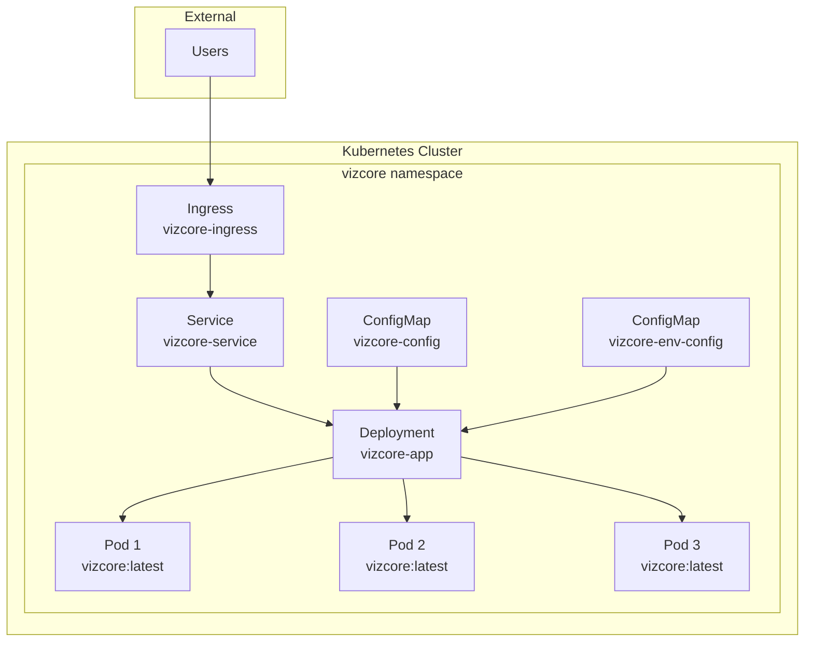

# VizCore Kubernetes Deployment

This directory contains Kubernetes manifests for deploying VizCore, a high-performance data visualization framework, to a Kubernetes cluster.

## Architecture Overview

The VizCore Kubernetes deployment consists of the following components:



## Components

### 1. Namespace (`namespace.yaml`)
- **Purpose**: Isolates VizCore resources from other applications
- **Name**: `vizcore`
- **Labels**: 
  - `name: vizcore`
  - `app: vizcore`

### 2. ConfigMap (`configmap.yaml`)
- **Name**: `vizcore-config`
- **Purpose**: Stores application configuration
- **Configuration**:
  - `NODE_ENV: production`
  - `LOG_LEVEL: info`
  - `MEMORY_THRESHOLD: 80`
  - `PERFORMANCE_MONITORING: true`

### 3. Deployment (`deployment.yaml`)
- **Name**: `vizcore-app`
- **Replicas**: 3 (for high availability)
- **Image**: `vizcore:latest`
- **Port**: 3000

#### Container Configuration
- **Resource Requests**:
  - Memory: 256Mi
  - CPU: 250m
- **Resource Limits**:
  - Memory: 512Mi
  - CPU: 500m

#### Health Checks
- **Liveness Probe**:
  - Endpoint: `/health`
  - Initial Delay: 30s
  - Period: 10s
  - Timeout: 5s
  - Failure Threshold: 3
- **Readiness Probe**:
  - Endpoint: `/ready`
  - Initial Delay: 5s
  - Period: 5s
  - Timeout: 3s
  - Failure Threshold: 3

#### Security Context
- **Pod Security**:
  - `runAsNonRoot: true`
  - `runAsUser: 1001`
  - `fsGroup: 1001`
- **Container Security**:
  - `allowPrivilegeEscalation: false`
  - `readOnlyRootFilesystem: true`
  - All capabilities dropped

#### Volumes
- **tmp**: EmptyDir for temporary files
- **var-cache**: EmptyDir for cache files

### 4. Service (`service.yaml`)
Two services are defined:

#### ClusterIP Service
- **Name**: `vizcore-service`
- **Type**: `ClusterIP`
- **Port**: 80 → 3000
- **Purpose**: Internal cluster communication

#### NodePort Service
- **Name**: `vizcore-nodeport`
- **Type**: `NodePort`
- **Port**: 80 → 3000
- **NodePort**: 30080
- **Purpose**: Direct external access (development/testing)

### 5. Ingress (`ingress.yaml`)
- **Name**: `vizcore-ingress`
- **Class**: nginx
- **Host**: `vizcore.yourdomain.com`
- **TLS**: Enabled with Let's Encrypt
- **Annotations**:
  - SSL redirect enabled
  - Automatic certificate management

### 6. Kustomization (`kustomization.yaml`)
- **Namespace**: vizcore
- **Common Labels**:
  - `app: vizcore`
  - `version: v0.1.0`
- **Image Management**: `vizcore:latest`
- **ConfigMap Generator**: `vizcore-env-config`

## Deployment Instructions

### Prerequisites
1. Kubernetes cluster (v1.20+)
2. kubectl configured
3. Docker image `vizcore:latest` available
4. NGINX Ingress Controller (for ingress)
5. cert-manager (for TLS certificates)

### Quick Deployment
```bash
# Deploy all resources
kubectl apply -k k8s/

# Check deployment status
kubectl get all -n vizcore

# View logs
kubectl logs -l app=vizcore -n vizcore --tail=100 -f
```

### Step-by-Step Deployment
```bash
# 1. Create namespace
kubectl apply -f k8s/namespace.yaml

# 2. Apply configuration
kubectl apply -f k8s/configmap.yaml

# 3. Deploy application
kubectl apply -f k8s/deployment.yaml

# 4. Create services
kubectl apply -f k8s/service.yaml

# 5. Setup ingress (optional)
kubectl apply -f k8s/ingress.yaml
```

## Accessing the Application

### Local Development (NodePort)
```bash
# Access via NodePort
http://localhost:30080
```

### Port Forwarding
```bash
# Forward local port to service
kubectl port-forward service/vizcore-service 3000:80 -n vizcore

# Access application
http://localhost:3000
```

### Production (Ingress)
```bash
# Update ingress.yaml with your domain
# Access via configured domain
https://vizcore.yourdomain.com
```

## Monitoring and Troubleshooting

### Check Pod Status
```bash
kubectl get pods -n vizcore
kubectl describe pod <pod-name> -n vizcore
```

### View Logs
```bash
# All pods
kubectl logs -l app=vizcore -n vizcore

# Specific pod
kubectl logs <pod-name> -n vizcore

# Follow logs
kubectl logs -l app=vizcore -n vizcore -f
```

### Check Services
```bash
kubectl get services -n vizcore
kubectl describe service vizcore-service -n vizcore
```

### Debug Network Issues
```bash
# Test service connectivity
kubectl run debug --image=busybox -it --rm --restart=Never -n vizcore -- sh

# Inside the debug pod:
nslookup vizcore-service
wget -qO- vizcore-service/health
```

### Check Resource Usage
```bash
kubectl top pods -n vizcore
kubectl describe nodes
```

## Scaling

### Manual Scaling
```bash
# Scale to 5 replicas
kubectl scale deployment vizcore-app --replicas=5 -n vizcore

# Verify scaling
kubectl get deployment vizcore-app -n vizcore
```

### Horizontal Pod Autoscaler (HPA)
```bash
# Create HPA (requires metrics-server)
kubectl autoscale deployment vizcore-app --cpu-percent=70 --min=3 --max=10 -n vizcore

# Check HPA status
kubectl get hpa -n vizcore
```

## Configuration Management

### Environment Variables
Environment variables can be managed through:
1. **ConfigMap**: `vizcore-config` (static configuration)
2. **Kustomization**: `vizcore-env-config` (generated configuration)

### Updating Configuration
```bash
# Edit configmap
kubectl edit configmap vizcore-config -n vizcore

# Restart deployment to pick up changes
kubectl rollout restart deployment vizcore-app -n vizcore
```

## Security Considerations

### Pod Security Standards
- Pods run as non-root user (UID 1001)
- Read-only root filesystem
- No privilege escalation
- All capabilities dropped
- Security context enforced

### Network Policies (Recommended)
Consider implementing network policies to restrict pod-to-pod communication:

```yaml
apiVersion: networking.k8s.io/v1
kind: NetworkPolicy
metadata:
  name: vizcore-network-policy
  namespace: vizcore
spec:
  podSelector:
    matchLabels:
      app: vizcore
  policyTypes:
  - Ingress
  - Egress
  ingress:
  - from:
    - namespaceSelector:
        matchLabels:
          name: ingress-nginx
    ports:
    - protocol: TCP
      port: 3000
```

## Backup and Recovery

### Configuration Backup
```bash
# Export all resources
kubectl get all,configmap,ingress -n vizcore -o yaml > vizcore-backup.yaml
```

### Disaster Recovery
```bash
# Restore from backup
kubectl apply -f vizcore-backup.yaml
```

## Performance Tuning

### Resource Optimization
1. **CPU**: Adjust based on workload patterns
2. **Memory**: Monitor usage and adjust limits
3. **Replicas**: Scale based on traffic patterns

### Monitoring Recommendations
- Use Prometheus + Grafana for metrics
- Implement custom metrics for business logic
- Set up alerting for critical thresholds

## Troubleshooting Common Issues

### Image Pull Errors
```bash
# Check image availability
docker images | grep vizcore

# Verify image name in deployment
kubectl describe deployment vizcore-app -n vizcore
```

### Health Check Failures
```bash
# Check if health endpoints exist
kubectl port-forward service/vizcore-service 3000:80 -n vizcore
curl http://localhost:3000/health
curl http://localhost:3000/ready
```

### Resource Constraints
```bash
# Check node resources
kubectl describe nodes

# Check pod resource usage
kubectl top pods -n vizcore
```

### Networking Issues
```bash
# Check service endpoints
kubectl get endpoints -n vizcore

# Test service connectivity
kubectl run test-pod --image=busybox -it --rm -n vizcore -- wget -qO- vizcore-service/health
```

## Cleanup

### Remove All Resources
```bash
# Delete using kustomization
kubectl delete -k k8s/

# Or delete namespace (removes everything)
kubectl delete namespace vizcore
```

### Selective Cleanup
```bash
# Remove specific resources
kubectl delete deployment vizcore-app -n vizcore
kubectl delete service vizcore-service -n vizcore
kubectl delete ingress vizcore-ingress -n vizcore
```

---

## Additional Resources

- [Kubernetes Documentation](https://kubernetes.io/docs/)
- [Kustomize Documentation](https://kustomize.io/)
- [NGINX Ingress Controller](https://kubernetes.github.io/ingress-nginx/)
- [cert-manager Documentation](https://cert-manager.io/docs/)
